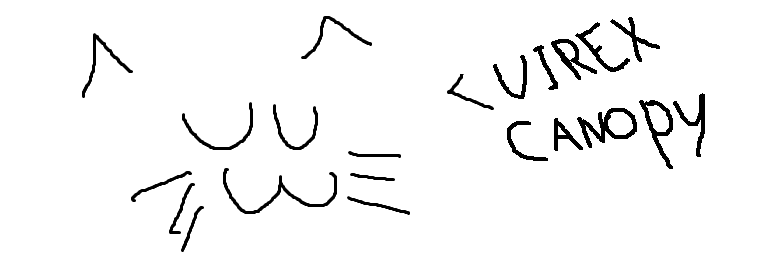
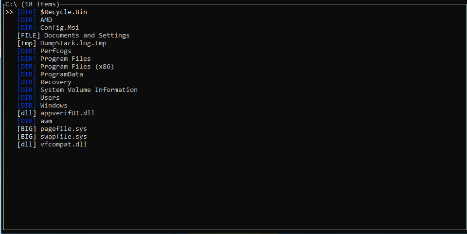
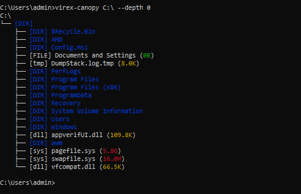
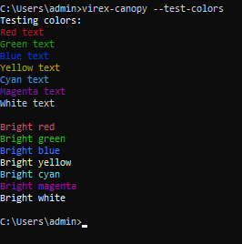
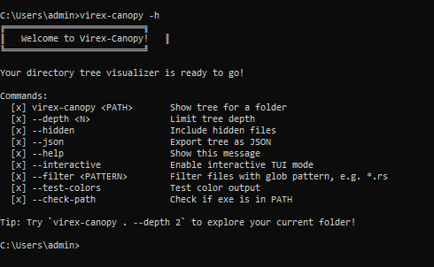

# Canopy

A command-line tool for generating and visualizing directory tree structures in the terminal!


## Usage

```
canopy <path>
```

Example:

```
canopy /path/to/directory
```

This will print a tree-like structure of the directory and its subdirectories.

## Screenshots!


Ran after just the `--interactive` flag!


Ran `virex-canopy C:\ --depth 0`


Ran just `--test-colors`


This is the `-h` flag command!


## Installation
### Option 1, Crates!

1. Simply use crates to install canopy!
2. Command:
   - `cargo install virex-canopy`
   - that's it!
     
### Option 2, Using the Installer

1. Download the installer binary for your platform from the releases page.

2. Run the installer:

   - Windows: `canopy-installer.exe`
   - Linux: `./canopy-installer`

   The installer will copy the canopy binary to your home directory and add it to your PATH.

### Option 3, From Source

1. Ensure you have Rust installed. Download from [rustup.rs](https://rustup.rs/).

2. Clone the repository:

   ```
   git clone <repository-url>
   cd canopy
   ```

3. Build the project:

   ```
   cargo build --release
   ```

4. The binary will be located at `target/release/canopy`.

5. To install manually, copy the binary to a directory in your PATH, e.g., `~/bin/` or `%USERPROFILE%\bin\`.

### Pre-built Binaries

Download the latest release for your platform from the releases page.

## Cross-Platform Support

Canopy is built with Rust and supports multiple platforms:

- Windows (x86_64)
- Linux (x86_64)

To build for a specific target:

- For Linux: `cargo build --release --target x86_64-unknown-linux-gnu`
- For Windows: `cargo build --release --target x86_64-pc-windows-gnu`

## Features

- Recursive directory traversal
- Clean tree visualization with Unicode box-drawing characters
- Sorted output for consistent results
- Error handling for invalid paths

## Contributing

Contributions are welcome! Please feel free to submit a Pull Request.

## License

This project is licensed under the MIT License.

